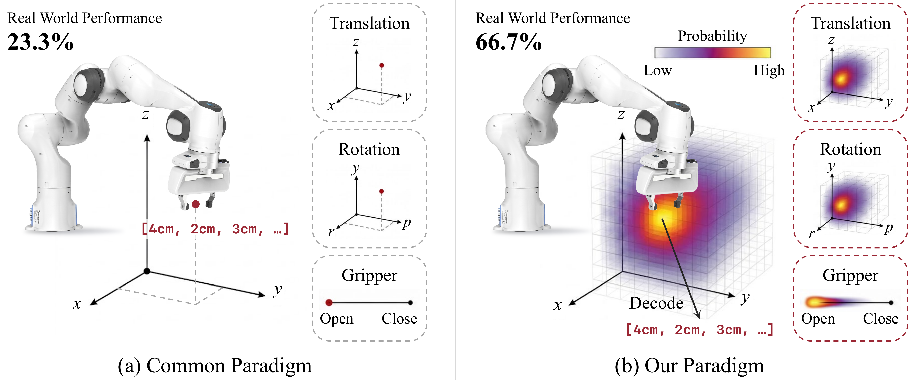

<div align="center">
<h1>ActionMap: Robot Policy Learning via Voxel Action Heatmap</h1>
</div>

<div align="center">
    <a href="https://yangpei-comp.github.io/">Pei Yang</a><sup>1,&#42;</sup>&nbsp;, <a href="https://scholar.google.com/citations?user=GMrjppAAAAAJ&hl=en">Hai Ci</a><sup>1,&#42;</sup>&nbsp;, <a href="https://chenanno.github.io/">Yanzhe Chen</a><sup>1,&#42;</sup>&nbsp;, <a href="https://aopolin-lv.github.io/">Qi Lv</a><sup>1</sup>&nbsp;, <a href="https://han-cai.github.io/">Han Cai</a><sup>2</sup>&nbsp;, and <a href="https://sites.google.com/view/showlab">Mike Zheng Shou</a><sup>1,&#x2709;</sup>
</div>

<div align="center">
    <sup>1</sup> <a href='https://sites.google.com/view/showlab/home?authuser=0' target='_blank'>Show Lab</a>, National University of Singapore
    &nbsp;&nbsp;
    <sup>2</sup> NVIDIA
</div>

<!--
<div align="center">
    <sup>&#42;</sup> Equal contribution &nbsp;&nbsp; <sup>&#x2709;</sup> Corresponding author
</div>
-->


<br/>

<div align="center">
    <a href='https://showlab.github.io/ActionMap/'>https://showlab.github.io/ActionMap/</a>
</div>

<br/>

<div align="center">
    <a href="https://arxiv.org/abs/2606.06904">
        
    </a>
</div>

<br/>

<div align="center">
    
</div>

<br/>

<div align="center">
    <b>ActionMap replaces the single-point action decoder of vision-language-action models with a voxel action heatmap, improving success rate, data efficiency, and convergence across LIBERO simulation and real-world Franka manipulation.</b>
</div>

<br/>

## 🧩 Pre-Release

Our code is coming soon. As a preview, we release the [core implementation](heatmap_action_head.py) of our action head. This action head could be used to replace a VLA's native action decoder (e.g., OpenVLA-OFT's L1 regression head). The example below shows how to plug it in.

```python
import torch
from heatmap_action_head import HeatmapActionHead

head = HeatmapActionHead(
    input_dim=4096,           # VLA backbone hidden size
    num_actions_chunk=8,      # action tokens per chunk
    action_dim=7,             # [x, y, z, r, p, w, grip]
    trans_grid=(32, 32, 16),  # translation voxel grid
    rot_grid=(16, 16, 16),    # rotation voxel grid
)

# Run your VLA backbone and keep the last hidden layer.
outputs = backbone(input_ids=input_ids, attention_mask=attention_mask, output_hidden_states=True)
hidden = outputs.hidden_states[-1]                       # (B, seq_len, llm_dim)

# Gather the hidden states at the action-token positions:
#   (B, num_actions_chunk * action_dim, llm_dim)
actions_hidden = hidden[:, action_token_indices]

# Training (ground-truth actions are normalized to [-1, 1]):
pred_actions, loss = head.predict_action_with_loss(actions_hidden, gt_actions)
loss.backward()

# Inference:
pred_actions = head.predict_action(actions_hidden)       # (B, num_actions_chunk, 7)
```

## 📄 Citation

```bibtex
@article{actionmap,
    title={ActionMap: Robot Policy Learning via Voxel Action Heatmap}, 
    author={Pei Yang and Hai Ci and Yanzhe Chen and Qi Lv and Han Cai and Mike Zheng Shou},
    year={2026},
    eprint={2606.06904},
    archivePrefix={arXiv},
    primaryClass={cs.RO},
    url={https://arxiv.org/abs/2606.06904}, 
}
```
